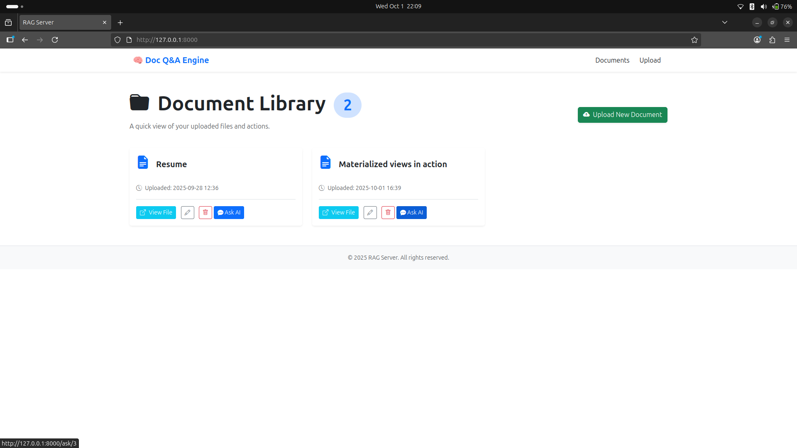
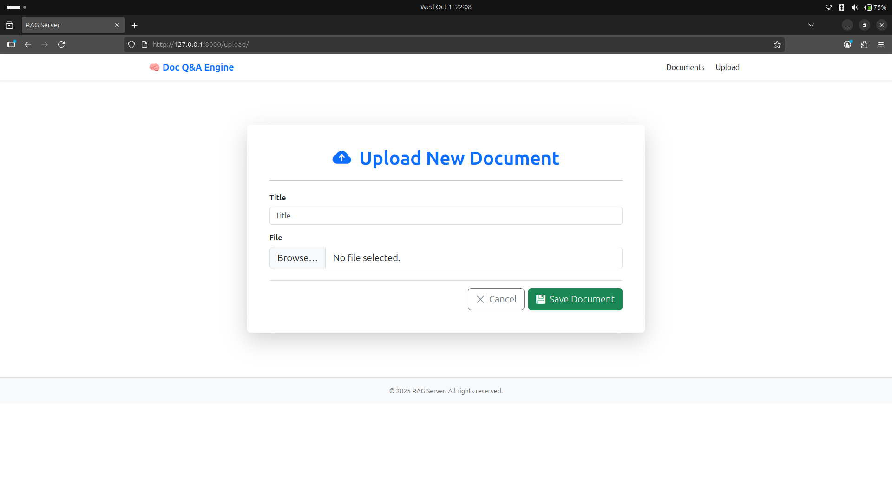
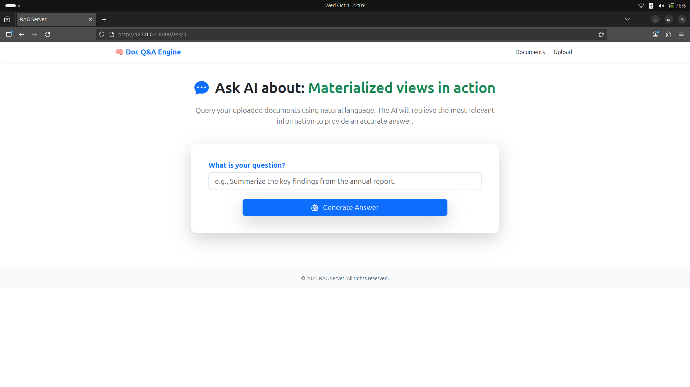
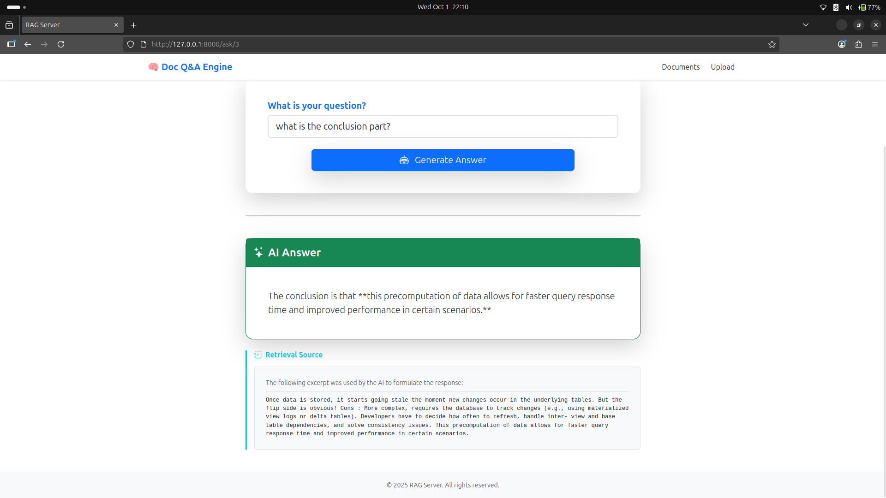
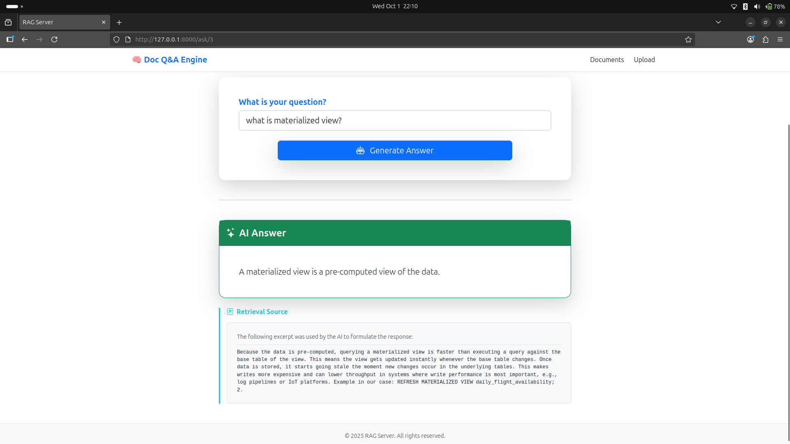
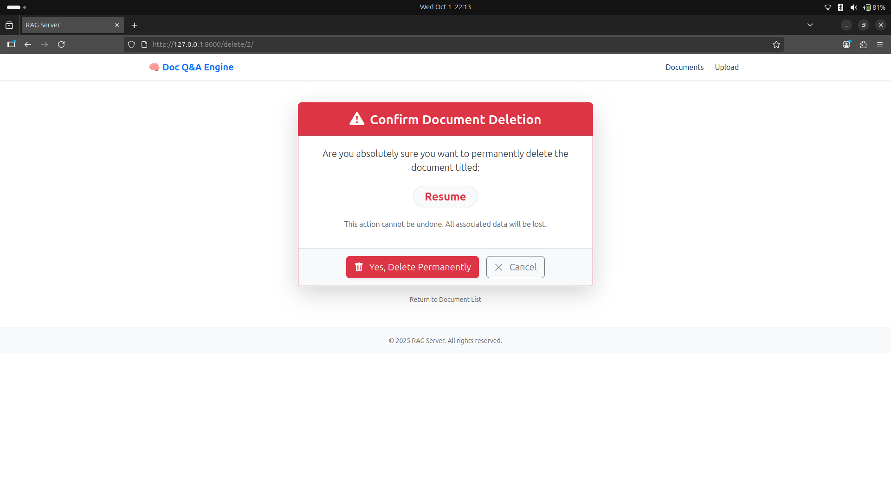
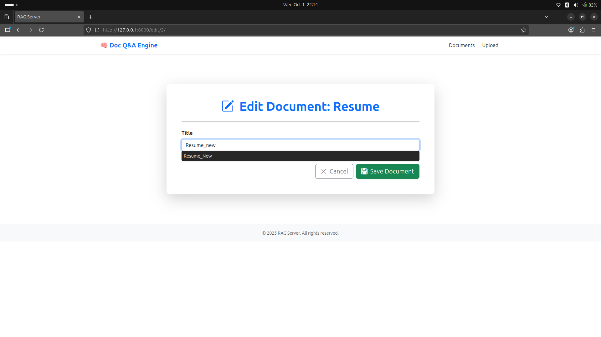

# Document Q&A Engine (RAG Server)

A Django-based web application that allows users to upload documents (PDF, TXT, Word), manage them with CRUD operations, and ask questions about their content. The app can provide answers using a keyword-based search or integrate with AI (Ollama, OpenAI, HuggingFace, or other local models).

## Features

- **CRUD Operations**
  - Upload documents
  - List uploaded documents
  - Edit document title/metadata
  - Delete documents

- **Question & Answer**
  - Input questions in plain English
  - Search uploaded documents for relevant information
  - Generate answers using AI (Ollama or other supported models)
  - Display snippets or documents used for the answer

- **Frontend**
  - Django templates with Bootstrap styling
  - Pages: Upload, Document List, Delete, Edit, Ask Question

- **Snapshots**








## Prerequisites

- Python 3.8+
- pip
- Ollama installed and configured for local AI model usage

## Installation

1. **Clone the repository**
   ```bash
   gh repo clone HarshKorde5/Document_QA_Engine_RAG_Server
   cd rag_engine
   ```

2. **Create and activate a virtual environment**
   ```bash
   python -m venv .venv
   # mac/linux
   source .venv/bin/activate
   # windows (PowerShell)
   # .\.venv\Scripts\Activate.ps1
   ```

3. **Install dependencies**
   ```bash
   pip3 install -r requirements.txt
   ```

4. **Apply migrations**
   ```bash
   python3 manage.py migrate
   ```

5. **Create superuser (optional)**
   ```bash
   python3 manage.py createsuperuser
   ```

6. **Run the development server**
   ```bash
   python3 manage.py runserver
   ```

   Access the app at `http://127.0.0.1:8000/`

## Ollama AI Integration

1. Install and run Ollama with your preferred local model.(gemma3:1b for faster execution as its lighter model) 
2. Ensure Ollama is accessible from your system.
3. Use a helper function in Django to call Ollama and generate answers.
4. Pass relevant document snippets as `context` when generating AI responses.

## Usage

- Upload documents via the Upload page.
- Manage documents in the Document List page.
- Ask questions on the Ask Question page.
- AI-generated answers are provided using Ollama.


## Security & Notes

- Uploaded documents may contain sensitive data; ensure Ollama runs locally for privacy.
- For production, use secure storage (e.g., S3) and authentication.

## Optional Enhancements

- Add embeddings + FAISS for real RAG functionality.
- Chunking for improved text search.
- User authentication for per-user document access.
- Background tasks for large files and embeddings.


**Contributing**

Contributions to this project are welcome! If you encounter any issues or have suggestions for improvements, please feel free to submit a pull request.


**Contact**

📧 Email: harshkorde05@gmail.com 

🌐 LinkedIn: [linkedin.com/in/harshkorde](https://www.linkedin.com/in/harshkorde)

For any further questions or inquiries, feel free to reach out. We are happy to assist you with any queries.